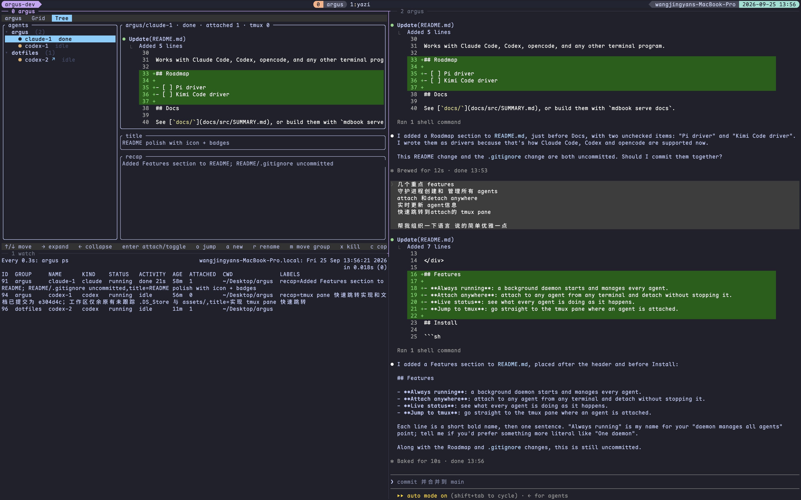

<div align="center">


# argus

**Run coding agents in the background and see what each one is doing.**


<br><br>



</div>

## Features

- **Always running**: a background daemon starts and manages every agent.
- **Attach anywhere**: attach to any agent from any terminal and detach without stopping it.
- **Live status**: see what every agent is doing as it happens.
- **Jump to tmux**: go straight to the tmux pane where an agent is attached (optional; requires tmux).

## Requirements

- Rust 1.85+ (edition 2024)
- macOS or Linux
- `tmux`, only for the "jump to tmux" dashboard action

## Install

Clone the repository, then install all three binaries. All of them are needed:
`argus` is the CLI, `argus-holder` keeps each agent alive, and `argus-hook`
reports what an agent is doing.

```sh
cargo install --path crates/argus
cargo install --path crates/argus-holder
cargo install --path crates/argus-hook
```

After upgrading, restart the manager so it runs the new code. Running agents
are not affected:

```sh
argus manager restart
```

## Use

```sh
argus run claude     # start an agent and attach; detach with Ctrl-\
argus grid           # dashboard of every agent
```

Detaching with `Ctrl-\` leaves the agent running; reattach later with
`argus attach claude-1` or pick it from `argus grid`.

Works with [Claude Code](docs/src/agents/claude.md),
[Codex](docs/src/agents/codex.md), [opencode](docs/src/agents/opencode.md),
[pi](docs/src/agents/pi.md), [omp](docs/src/agents/omp.md), and
[any other terminal program](docs/src/agents/generic.md).

## Roadmap

- [x] Pi driver
- [ ] Kimi Code driver

## Docs

See [`docs/`](docs/src/SUMMARY.md), or build them with `mdbook serve docs`.

## License

[MIT](LICENSE)
