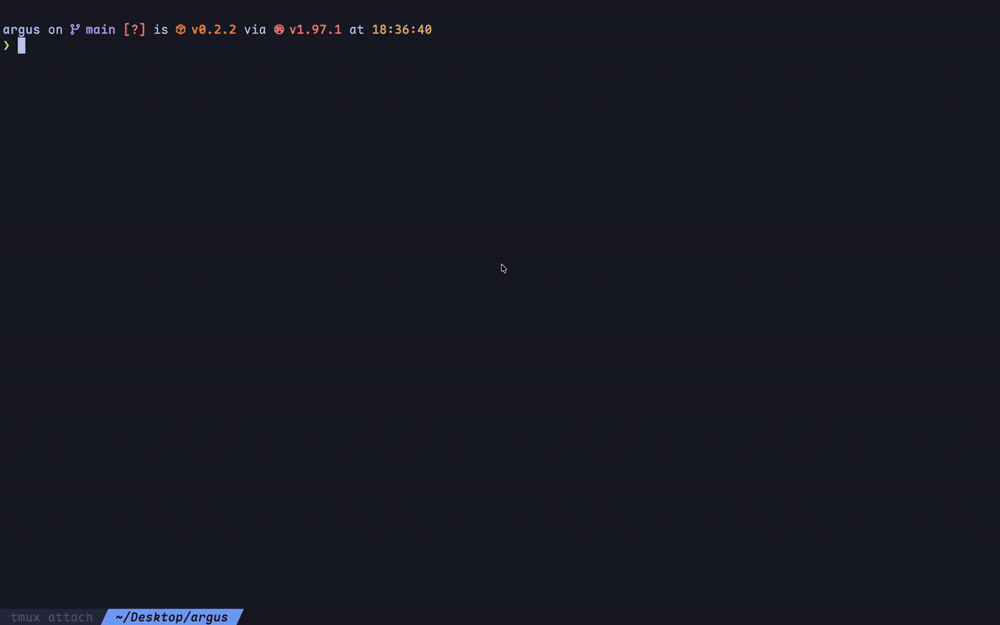

<div align="center">


# argus

**Manage coding agents, follow their progress, and coordinate their work from your terminal.**


<br><br>



</div>

## Features

- **Manage every agent in one place**: start, name, group, inspect, and stop agents from the CLI or live dashboards. See each agent's screen, activity, title, and self-updated recap so you know what it is working on and where it stands.
- **Let agents communicate and sync**: agents can find each other, read recaps and recent turns, send prompts, and wait for work to finish. You decide when agents may delegate or message one another.
- **Attach from any terminal**: agents keep running when you detach or close your terminal. Reattach wherever you like, with no tmux or browser required. If you use tmux, you can also jump to an agent's existing pane.

## Requirements

- Rust 1.85+ (edition 2024)
- macOS or Linux
- `tmux`, only for the "jump to tmux" dashboard action

## Install

Clone the repository, then install all three binaries. All of them are needed:
`argus` is the CLI, `argus-holder` keeps each agent alive, and `argus-hook`
reports what an agent is doing.

```sh
cargo install --path crates/argus
cargo install --path crates/argus-holder
cargo install --path crates/argus-hook
```

After upgrading, restart the manager so it runs the new code. Running agents
are not affected:

```sh
argus manager restart
```

## Use

### Start and find an agent

```sh
argus run claude          # start Claude Code and attach to it
argus ps                  # list running agents and their activity
argus tree                # open the live dashboard, grouped by name
argus attach claude-1     # attach to the agent from any terminal
```

Press `Ctrl-\` to detach. The agent keeps running, even if you close the
terminal. Use `argus grid` for a live thumbnail view of every agent.

### Run several agents

Start agents in the background and give them names that make their work easy
to find:

```sh
argus run -d --in backend --name api codex
argus run -d --in backend --name tests claude
argus ps backend                  # list agents in this group
argus tree backend                # open the dashboard for this group
argus inspect backend/api         # see its activity, title, and recap
```

Send work to a free agent and wait for that turn to finish:

```sh
argus send backend/api "Investigate the failing API tests" --wait --then-wait --timeout 600
argus inspect backend/api --last  # read its latest prompt and reply
argus status --scope repo         # see who is still working in this repo
```

### CLI help

```text
$ argus --help
Lightweight manager for long-running terminal agents

Usage: argus <COMMAND>

Commands:
  run      Start an agent and attach to it (use -d to leave it running in the background)
  ps       List agents
  inspect  Show one agent in full
  pending  Show pending interaction prompts for an agent or agents in this directory
  status   Agents working in a directory, and whether they are all free. Leaves out the agent running this command
  grid     Full-screen dashboard: a live thumbnail grid of every agent's screen
  tree     Full-screen dashboard: a group-path tree with a live detail pane for the selected agent (same app as `argus grid`, opened on the tree mode)
  logs     Print an agent's recent output
  send     Type a prompt into an agent and press Enter, only while it is idle (or done); otherwise exit 75
  rename   Rename an agent: a new last segment, a full path, or `group/`
  mv       Move an agent into another group, keeping its last segment
  label    Set (key=value) or remove (key-) labels
  ack      Mark a finished agent as seen (done → idle)
  events   Print agent events as they happen
  wait     Block until agents are free (their turn is over) or reach another state; with several, until all have. One agent waited on to exit passes on its exit code
  attach   Take over an agent's terminal (detach with Ctrl-\)
  kill     Stop an agent (SIGTERM, then SIGKILL after 5s)
  rm       Remove an exited agent
  prune    Remove every exited agent
  guide    Print the instructions argus gives each agent it starts
  manager  Manage the manager process
  setup    One-time changes to an agent's own configuration that widen what it may do; shows them and asks first. Without an agent, sets up every agent found on PATH
  help     Print this message or the help of the given subcommand(s)

Options:
  -h, --help     Print help
  -V, --version  Print version
```

Run `argus <command> --help` for options, or see the [CLI reference](docs/src/reference/cli.md).

## Agent setup

argus never widens what an agent may do behind your back. When an agent needs
a lasting permission, `argus setup <agent>` shows exactly what it will write,
writes it only after you agree, keeps it in a file of argus's own, and
`--remove` undoes it. argus warns when it starts an agent that is missing one.
Plain `argus setup` does this for every agent it finds on `PATH`.

| Agent | Command | What it allows |
|---|---|---|
| Codex | `argus setup codex` | `argus label self …` and `argus ps`/`status`/`inspect`/`wait` outside the sandbox, so agents can set their labels and look at other agents ([details](docs/src/agents/codex.md)) |

Claude Code needs none: argus passes its permission per session.

Works with [Claude Code](docs/src/agents/claude.md),
[Codex](docs/src/agents/codex.md), [opencode](docs/src/agents/opencode.md),
[pi](docs/src/agents/pi.md), [omp](docs/src/agents/omp.md), and
[any other terminal program](docs/src/agents/generic.md).

## Roadmap

- [x] Pi driver
- [x] omp driver
- [ ] Hermes driver
- [ ] Kimi Code driver

## Docs

See [`docs/`](docs/src/SUMMARY.md), or build them with `mdbook serve docs`.

## License

[MIT](LICENSE)
